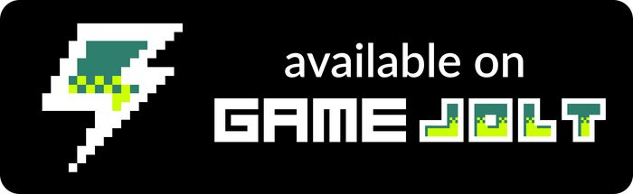

<h1 align="center">
  
</h1>

**- [Pulsa aquí para la versión en español.](README.md)**
 
 

After the coming to power of the war machines, the robots that helped the humans in the battle against them were taken as prisoners in the old work center of Sonoran, under the same desert. Seruel-700, one of these robots, will not give up so easily.

## Project build

The project is created using Unity 2021.3.5f1.

Just clone the repository or copy the files contained in it and open the project with Unity. The necessary resources will be installed automatically.

Once inside the Unity editor, the project can be modified and compiled.

## Game instructions

Use the on-screen buttons to move the player jump. Use the on-screen stick to shoot.

The language of the game can be chosen in the window that appears the first time it is played, but it can always be changed from the "Options" menu.

## Game download

Currently, this version of the application can be downloaded from the following sites.

<a href="https://sergiomejias.itch.io/escape-from-sonoran">
<a href="https://gamejolt.com/games/escape-from-sonoran/740261">
<a href="https://play.google.com/store/apps/details?id=com.SergioMejias.EscapeFromSonoran">
<a href="https://galaxy.store/sonoran">